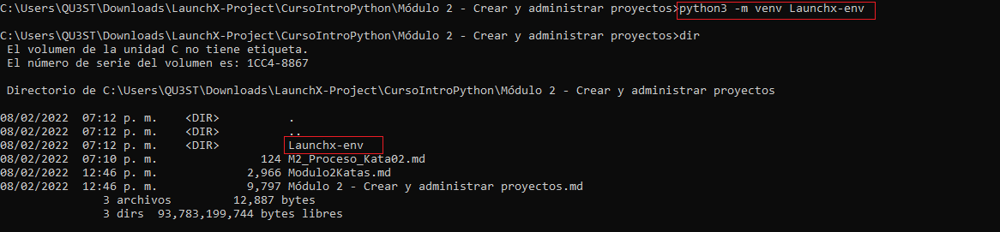
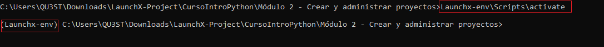
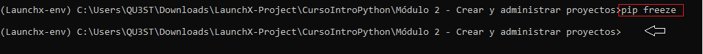
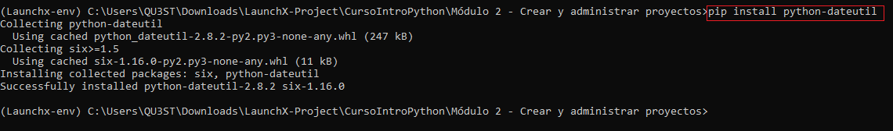
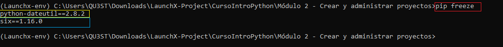
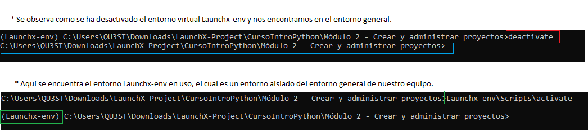

# Ejercicio - Crear un paquete

## Crear un entorno virtual

 Ejecutar en su terminal: ``python3 -m venv LaunchX-env``

 

 Se activa el entorno virtual: ``Launchx-env\Scripts\activate``

  

 Se ejecuta el comando ``pip freeze`` para ver las bibliotecas instaladas en tu entorno: (Se devuelve vacio ya que no se encuentra bibliotecas instaladas)
 

Se instala la bilioteca python-dateutil con el comando: ``pip install python-dateutil``

 Se ejecuta nuevamente el comando ``pip freeze`` para ver las bibliotecas instaladas en tu entorno: (Retorna las bibliotecas instaladas en este caso observamos la biliote de ``python-dateutil``)

Ejecuta el comando ``deactivate`` (Observa cómo cambia el mensaje de tu terminal ``(Launchx-env)`` a cómo se veía antes. ):

